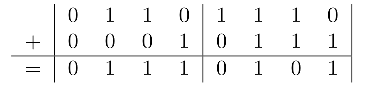

# 4BitAddition

> The algorithm takes 4 4-bit signed integers. Pack them into 2 8-bit integers. Perform bitmanuplation and extract two signed ints from the 8 bit int.

Eg.
(6,-2) -> 01101110
+
(1,7)  -> 00010111
=
01110101 -> (7,5)

 
